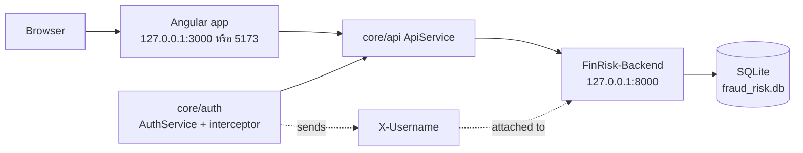
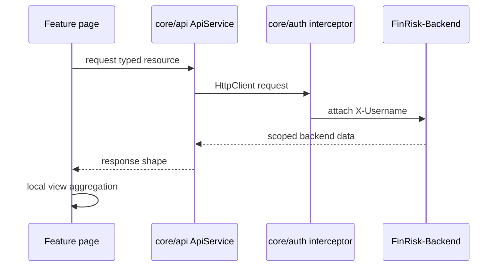

# FinRisk Frontend Architecture

เอกสารนี้ล็อกสถาปัตยกรรมของ `FinRisk-Frontend` หลังแยก repo ออกจาก backend แล้ว
เป้าหมายคือให้ Phase 1 dashboard พัฒนาเพิ่มได้โดยไม่ทำให้ logic กระจายซ้ำในหลายหน้า

## Runtime Topology



Frontend เป็น client-only Angular app. Backend เป็น owner ของข้อมูล, role scope, risk engine result,
และ mock auth. Frontend ไม่คำนวณ risk score ใหม่เอง ทำเฉพาะ presentation, aggregation เพื่อกราฟ,
และ guardrail การแสดงข้อมูลไม่สมบูรณ์

## Source Layout

```text
src/app/
├── auth/                       # login route
├── core/
│   ├── api/                    # one backend interface for all HTTP calls
│   ├── auth/                   # session module, guard, X-Username interceptor
│   └── models/                 # response/domain shapes matching backend
├── features/
│   ├── project-risk/           # F1
│   ├── financial-health/       # F2
│   ├── risk-factors/           # F3
│   └── trends/                 # F4
├── layout/                     # authenticated shell
└── shared/
    ├── charts/                 # ECharts adapters
    ├── filters/                # shared filter module
    ├── ui/                     # presentational modules
    └── utils/                  # pure display helpers
```

## Core Modules

### `core/api`

`ApiService` is the only module that knows backend endpoint paths.

Interface:
- methods map one-to-one to backend resources
- accepts query filters as typed objects
- returns backend response shapes, not view models

Implementation:
- builds query params
- calls `HttpClient`
- relies on `core/auth` interceptor for `X-Username`

Rule: feature pages must not call `HttpClient` directly. Add or change backend access at this seam.

### `core/auth`

Session module for mock backend auth.

Interface:
- `login(username, password)`
- `logout()`
- `isAuthenticated()`
- current user/token state

Implementation:
- stores backend token in `localStorage`
- token is the username
- interceptor attaches `X-Username: <token>`
- guard protects authenticated routes

This is intentionally isolated because production auth will replace this implementation later without
rewriting feature pages.

### `core/models`

Shared data shapes that mirror backend responses.

Rule: keep backend field names here. Translate to UI labels in feature/shared modules, not in the model.

## Feature Modules

Each feature owns page-level loading, error, and aggregation needed only by that page.
Shared display behaviour moves to `shared/`; backend calls stay in `core/api`.

| Feature | Route | Backend resources | Responsibility |
|---|---|---|---|
| F1 Project Risk Dashboard | `/project-risk` | `/risk/summary`, `/projects`, `/subdistricts` | KPI, risk heatmap, project ranking, yearly project aggregation |
| F2 Annual Financial Health | `/financial-health` | `/risk/annual`, `/subdistricts` | annual factor cards, observed value chart, computable gap display |
| F3 Risk Factor Analysis | `/risk-factors` | `/projects`, `/projects/{id}`, `/risk/factors` | project drill-down and evidence text |
| F4 Time Series & Trend Analysis | `/trends` | `/projects`, `/risk/annual`, `/subdistricts` | cross-year/cross-subdistrict trend views |

## Shared Modules

### `shared/charts`

Adapters around ECharts. They are deep modules: feature pages pass small chart data structures, while
chart option details stay inside the adapter.

Rules:
- missing/uncomputable values must be `null`, never `0`
- time-series charts must preserve gaps
- visual risk colors stay consistent: high red, medium yellow, low green
- chart modules must not fetch data

### `shared/filters`

Shared filter module for subdistrict, year, and risk-level controls. It emits filter state only.
Feature pages decide which backend call to run.

### `shared/ui`

Presentational modules:
- `RiskBadge`
- `KpiCard`
- `EmptyState`
- `GuardrailBanner`

These modules have no backend knowledge.

## Data Flow



Backend owns authorization and subdistrict scope. Frontend filters improve UX but are not trusted for access control.

## Time-Series Policy

The frontend must preserve the difference between:
- real zero value
- missing value
- `computable=false`

Display rules:
- `computable=false` renders as `ประเมินไม่ได้ (ข้อมูลไม่พอ)`
- charts receive `null` for uncomputable/missing values
- line charts leave a visible gap instead of drawing to zero
- if a selected series has fewer than 2 computable years, show a single-point view and explain that trend/Yoy needs at least 2 years
- show data coverage explicitly: `ปีที่มีข้อมูล: 2566-2568`

## Environment Interface

`src/environments/environment.ts`

```ts
export const environment = {
  apiBaseUrl: 'http://127.0.0.1:8000',
};
```

Allowed dev origins must also exist in backend CORS config:
- `http://localhost:3000`
- `http://127.0.0.1:3000`
- `http://localhost:5173`
- `http://127.0.0.1:5173`

## Adding a New Feature

1. Add lazy route under `app.routes.ts`.
2. Create a feature page under `src/app/features/<feature-name>/`.
3. Add backend calls to `core/api` first.
4. Add response shapes to `core/models` if backend returns a new shape.
5. Reuse `shared/charts`, `shared/filters`, and `shared/ui` before creating new modules.
6. Keep page aggregation local until at least two feature pages need the same behaviour.

## Test Seams

Preferred test seams:
- `core/api`: query params and endpoint mapping
- `core/auth`: login persistence and `X-Username` attachment
- `shared/charts`: `null` gap conversion
- feature pages: loading/error/empty states and page-level aggregation

Do not test by reaching into ECharts internals. Test the chart adapter interface.

## Future Architecture Work

- Replace mock auth implementation behind `core/auth` when backend moves to JWT.
- Add a financial raw-data module only after backend exposes `/financials`.
- Add e2e tests for all four feature routes after CI is configured.
